# qwen-decoder

从零实现 Qwen2.5 LLM 推理引擎，支持 GGUF 格式，实现完整推理链路并逐步 GPU 优化。

## 项目结构

| 文件/目录 | 说明 |
| :--- | :--- |
| `common.h/cpp` | 公共数据结构（Config、Weights、Tokenizer）和函数（GGUF 加载、BPE tokenizer、采样） |
| `gguf_loader.h/cpp` | GGUF 文件格式解析 |
| `decoder.h/cpp` | Decoder 基类，generate_continuous 逻辑 |
| `scheduler.h/cpp` | 请求调度器，continuous batching 核心 |
| `kv_cache.h/cpp` | BlockPool + BlockTable，PagedAttention KV cache 管理，引用计数 |
| `prefix_cache.h/cpp` | Prefix Cache，block 粒度 KV 复用，LRU 淘汰 |
| `gpu_decoder.cu/h` | GPU 推理核心，包含所有 CUDA kernel |
| `gpu_main.cu` | 单机推理入口 |
| `inference_server.cu` | HTTP 推理服务（Drogon），兼容 OpenAI API，支持单机和 P/D 分离两种模式 |
| `prefill_main.cu` | P/D 分离 P节点入口 |
| `decode_main.cu` | P/D 分离 D节点入口 |
| `pd_comm.h/cpp` | P/D 分离通信层，gRPC 注册 + NCCL KV cache 传输 |
| `proto/` | gRPC proto 定义 |
| `cpu_decoder.h/cpp` | CPU 版本实现 |
| `tests/` | softmax / attention 算法对比实现（numpy/torch/C++/CUDA） |
| `doc/` | nsys profile 截图 |

## 实现的核心模块

**模型加载：**
- GGUF 文件格式解析（header、metadata key-value、tensor 描述）
- mmap 零拷贝加载权重
- fp16 权重直接上传 GPU

**Tokenizer：**
- GPT2 BPE tokenizer（encode/decode）
- bytes_to_unicode 完整映射（256 字节全覆盖）
- 特殊 token 识别（`<|im_start|>`、`<|im_end|>` 等）
- Chat template 格式化

**Forward Pass：**
- Embedding lookup（fp16）
- RMSNorm（warp reduce 归约）
- QKV 投影（cublasHgemm fp16）
- Q/K/V bias
- RoPE 位置编码（动态计算，rope_freq_base=1000000）
- KV Cache（fp16，PagedAttention 动态分页）
- Multi-Head Attention（GQA，n_heads=16，n_kv_heads=2）
- SwiGLU FFN
- Temperature + Top-K 采样

**推理优化：**
- batch prefill（gemv→gemm），prefill 速度提升 18x
- continuous batching，GPU Kernels 占比从 27% 提升到 87%
- PagedAttention，KV cache 动态分页，消除显存碎片
- 1-flat 推理 + chunked prefill，64并发总吞吐 1341 tokens/s，较手写 kernel 提升 187x
- Prefix Cache，block 粒度 KV 复用 + 引用计数 + LRU 淘汰，512并发吞吐提升 20%
- P/D 分离，gRPC 连接管理 + NCCL KV cache 传输，D节点 GPU 利用率 94.5%

**推理服务：**
- OpenAI 兼容 HTTP 接口（`POST /v1/chat/completions`）
- 支持流式（SSE）和非流式两种响应
- 支持单机模式和 P/D 分离模式，启动参数控制切换

## 环境依赖

- Linux
- NVIDIA GPU + CUDA 12.x（单机至少 10GB 显存）
- CMake 3.18+
- NCCL 2.26.2+
- gRPC 1.51.1+
- Drogon 1.9.12+

## 编译

```bash
mkdir build && cd build
cmake -DCMAKE_BUILD_TYPE=Release ..
make -j
```

## 模型下载

```bash
HF_ENDPOINT=https://hf-mirror.com python -c "
from huggingface_hub import snapshot_download
snapshot_download(
    repo_id='Qwen/Qwen2.5-3B-Instruct-GGUF',
    allow_patterns=['*fp16*'],
    local_dir='.'
)
"
```

3B fp16 模型分为两个分片，需要先用 llama.cpp 工具合并：

```bash
/path/to/llama.cpp/build/bin/llama-gguf-split \
    --merge \
    qwen2.5-3b-instruct-fp16-00001-of-00002.gguf \
    qwen2.5-3b-instruct-fp16.gguf
```

## 运行

**单机推理：**
```bash
./gpu_decoder_main qwen2.5-3b-instruct-fp16.gguf
```

**推理服务（单机模式）：**
```bash
./inference_server qwen2.5-3b-instruct-fp16.gguf 64 8080
```

**推理服务（P/D 分离模式）：**
```bash
# P节点先启动（enable_prefix_cache=1 开启）
NCCL_SOCKET_IFNAME=eth0 ./prefill_node qwen2.5-3b-instruct-fp16.gguf 512 1

# inference_server 作为 D节点
NCCL_SOCKET_IFNAME=eth0 ./inference_server qwen2.5-3b-instruct-fp16.gguf 64 8080 --prefill-node <p_ip>

# 或者单独跑 decode_node
NCCL_SOCKET_IFNAME=eth0 ./decode_node qwen2.5-3b-instruct-fp16.gguf <p_ip>
```

**测试接口：**
```bash
# 非流式
curl http://localhost:8080/v1/chat/completions \
  -H "Content-Type: application/json" \
  -d '{"messages":[{"role":"user","content":"你好"}],"stream":false}'

# 流式
curl http://localhost:8080/v1/chat/completions \
  -H "Content-Type: application/json" \
  -d '{"messages":[{"role":"user","content":"你好"}],"stream":true}'
```

**压测：**
```bash
# 安装 wrk
sudo apt install wrk

# bench.lua
# wrk.method = "POST"
# wrk.headers["Content-Type"] = "application/json"
# wrk.body = '{"messages":[{"role":"user","content":"hi"}],"max_tokens":50,"stream":false}'

wrk -t4 -c64 -d30s --timeout 60s -s bench.lua http://localhost:8080/v1/chat/completions
```

## 性能对比（Qwen2.5-3B fp16，RTX 5060 Ti 16GB，temperature=0）

### 完整优化路径

| 版本 | tokens/s | 较 v1 提升 | 说明 |
| :--- | :--- | :--- | :--- |
| CPU C++ | 0.11 | - | fp16 逐元素转换，朴素 matmul |
| GPU v1 | 7.18 | 1x | 手写 fp16 matmul kernel |
| GPU v2 | 47.48 | 6.6x | cublasHgemm，中间状态仍是 fp32 |
| GPU v3 | 48.29 | 6.7x | 全程 fp16，消除类型转换开销 |
| GPU v4 | 48.99 | 6.8x | Flash Attention decode 阶段（无提升） |
| GPU v5 | 53.12 | 7.4x | batch prefill，prefill 速度提升 18x |
| GPU v6 | 52.60 | 7.3x | batch prefill + flash attention（反而更慢） |
| GPU v7 | 209.34 | 29x | fixed batch decode，4并发 |
| GPU v8 | 168.0 | 23x | continuous batching，4并发 |
| GPU v9 | 869.9 | 121x | PagedAttention，64并发 |
| GPU v10 | 1341.0 | 187x | 1-flat 推理，64并发 |
| GPU v12（单机）| 2366.6 | 330x | Prefix Cache，512并发 |

### Prefix Cache 性能对比（512 并发，相同 prompt）

| 模式 | 无 Prefix Cache | 有 Prefix Cache | 提升 |
| :--- | :--- | :--- | :--- |
| 单机（512路） | 1972 tokens/s | 2366 tokens/s | +20% |
| P/D 分离（512路） | 1574 tokens/s | 1783 tokens/s | +13% |

### prefill 阶段对比（prompt=3528 tokens）

| 版本 | prefill tokens/s | 说明 |
| :--- | :--- | :--- |
| GPU v4 | ~58 | 逐 token 循环，flash attention decode kernel |
| GPU v5 | ~1059 | batch prefill，standard attention |
| GPU v6 | ~578 | batch prefill，flash attention（反而更慢） |

### GPU 利用率对比

| 版本 | 并发数 | GPU Kernels | 说明 |
| :--- | :--- | :--- | :--- |
| v7 | 4 | 27% | fixed batch，槽位浪费 |
| v8 | 4 | 87% | continuous batching |
| v9 | 64 | 90.7% | PagedAttention |
| v10 | 64 | 68.5% | 1-flat，prefill 阶段 memcpy 较多 |
| v11（D节点） | - | 94.5% | P/D 分离，D节点专注 decode |
| v12（单机，512路）| 512 | 96.1% | Prefix Cache |

## 优化分析

### GPU v1 → v2（6.6x 提升）

用 `cublasHgemm` 替换手写 `matmul_fp16_kernel`。v1 手写 kernel 的 grid 只有几个 block，SM 大量闲置。cuBLAS 底层使用 cutlass，自动选择最优调度。

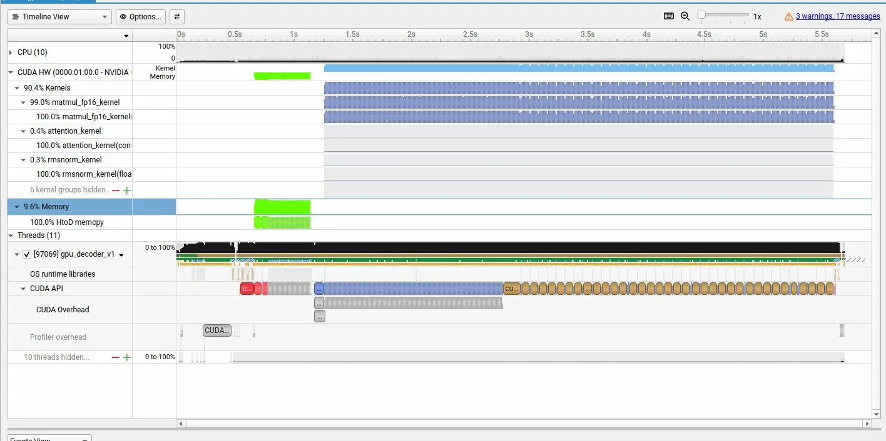

---

### GPU v2 → v3（6.7x 提升）

把所有中间状态从 `float*` 改成 `__half*`，消除每次 matmul 前后的类型转换 kernel，显存占用减半。

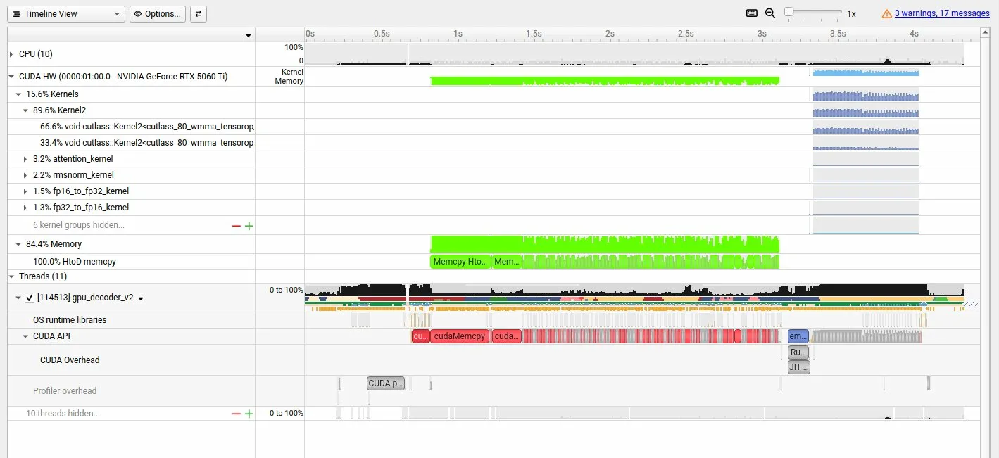
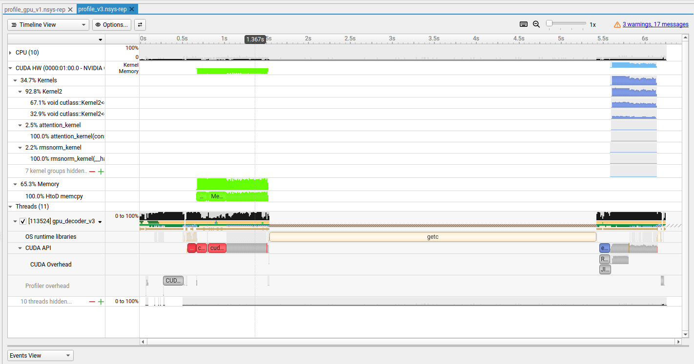

---

### GPU v3 → v4（Flash Attention decode，无提升）

decode 阶段 q 只有 1 行，scores 大小为 `1 × seq_len`，分块反而导致 K/V 被多次读取，Memory 占比从 38.3% 升到 51.0%。

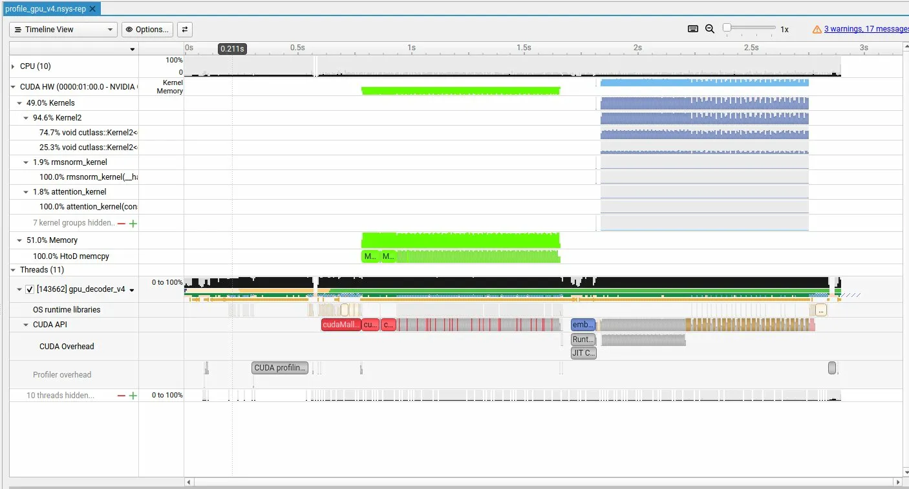

---

### GPU v4 → v5（batch prefill，18x prefill 提升）

把逐 token prefill 改成 batch prefill：

```
逐 token: matmul [1, dim] × [dim, dim]  → gemv，GPU 利用率低
batch:    matmul [n, dim] × [dim, dim]  → gemm，GPU 利用率高
```

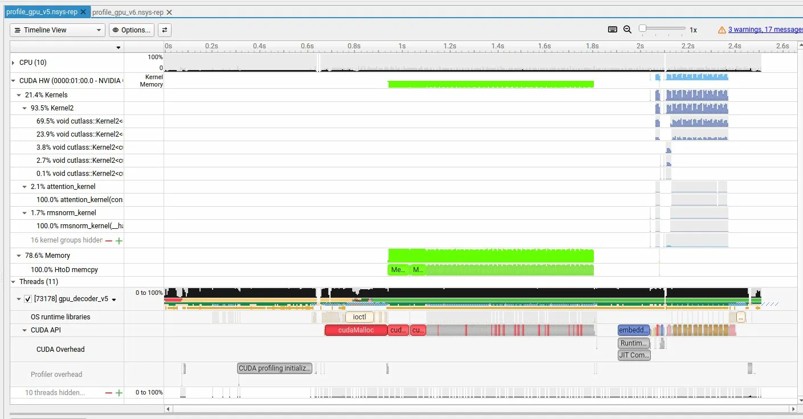

---

### GPU v5 → v6（Flash Attention prefill，反而更慢）

实验验证了简化版 flash attention（只分 K/V 块，不分 Q 块）在 prefill 阶段反而更慢，HBM 读写仍是 O(n²)。真正的 flash attention 需要 Q/K/V 双重分块才能将 HBM 读写降到 O(n)。

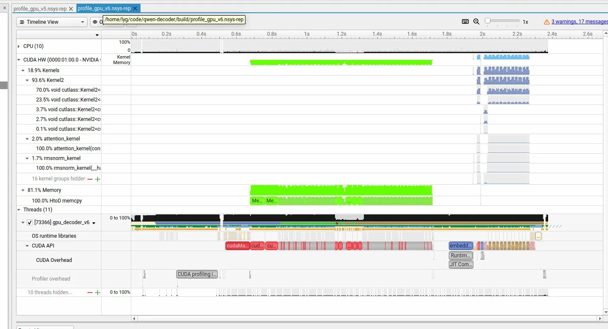

---

### GPU v6 → v7（fixed batch decode，总吞吐 4x）

实现 fixed batch decode，支持多请求同时推理。

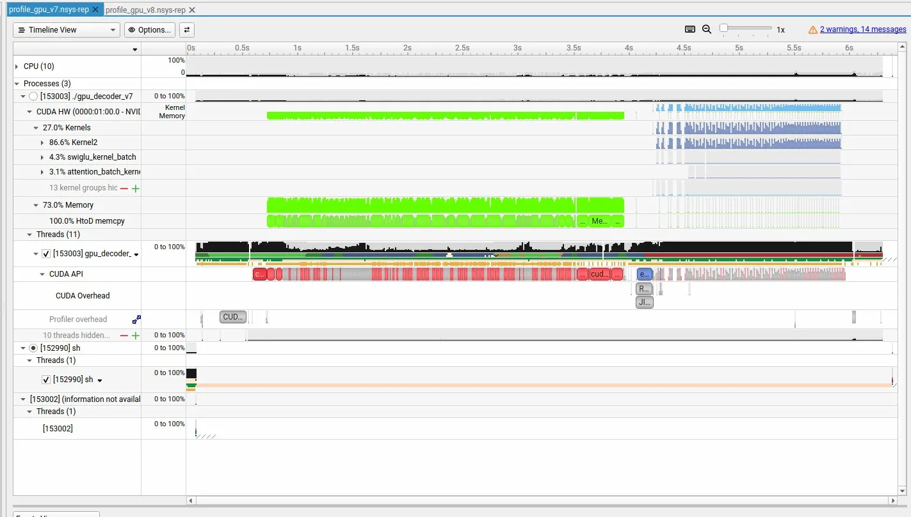

---

### GPU v7 → v8（continuous batching，GPU 利用率 87%）

完成的请求立即让出槽位给等待队列里的新请求，GPU 始终满载。

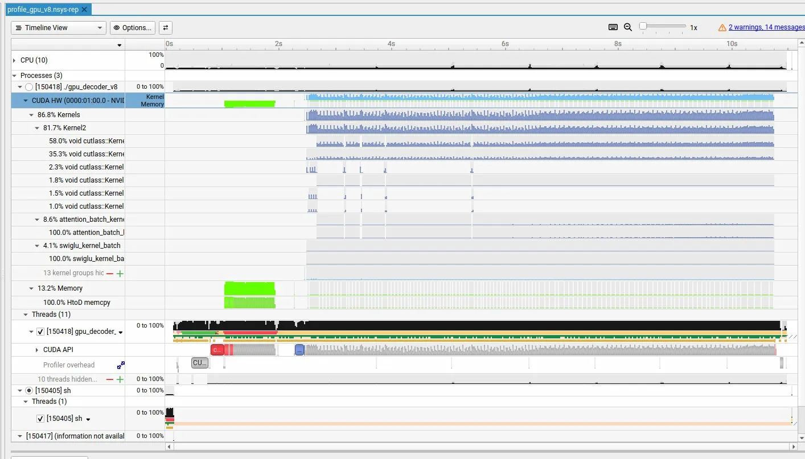

---

### GPU v8 → v9（PagedAttention，GPU 利用率 90.7%）

KV cache 从静态预分配改为动态分页分配，消除显存碎片，支持更大并发。

核心数据结构：

```
BlockPool：管理所有物理块，空闲块队列，allocate()/free()
BlockTable：每个请求的逻辑块→物理块映射
  table[0]=9, table[1]=3, table[2]=7  ← 物理块不必连续

attention kernel 通过 BlockTable 查找：
  token t → 逻辑块 t/block_size → 物理块 id → 实际地址
```

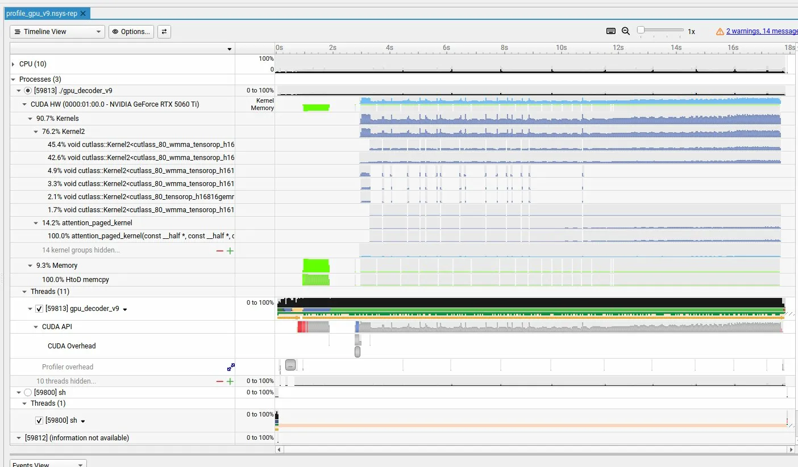

---

### GPU v9 → v10（1-flat 推理，187x 提升）

四处核心改动：

1. **1-flat 推理**：所有请求的 token 打包成一个 flat batch，matmul/FFN 一次处理
2. **chunked prefill**：每步 prefill token 总数不超过上限，和 decode 请求交替进行，降低 TTFT
3. **decode attention 并行**：gather_q → 一次 launch 处理所有 decode token → scatter_xb
4. **block_table 增量更新**：只上传有变化槽位的实际用到的 block 数

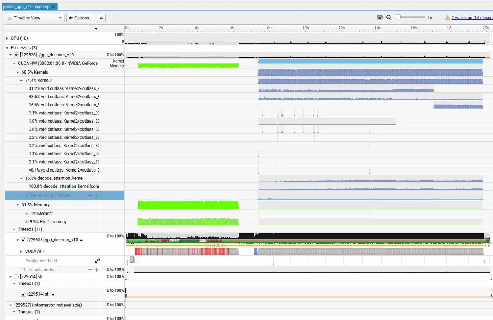

---

### GPU v10 → v11（P/D 分离，D节点 GPU 利用率 94.5%）

P节点专注 prefill，D节点专注 decode，通过 gRPC 管理连接，NCCL 传输 KV cache。

```
D节点 nsys profile：
  Stream 13（decode）:  73.4% Kernels
  Stream 14（NCCL）:    21.4% Kernels（接收 KV cache）
```

单机 vs D节点对比：

```
              单机（v10）    D节点（v11）
Kernels:      68.5%         94.5%
Memory:       31.5%          5.5%
```

1Gbps 网络下 KV cache 传输可行，生产环境需要 RDMA 消除网络瓶颈。

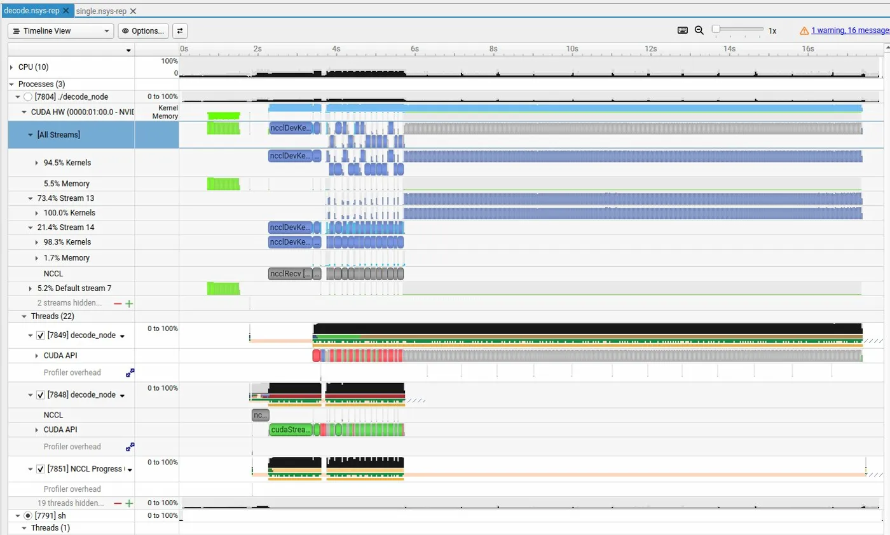

---

### GPU v10 → v12（Prefix Cache，吞吐提升 20%）

以 block 为粒度缓存 KV，key 是前缀 token 序列的累积 hash，引用计数管理物理块生命周期，LRU 淘汰策略。

```
命中时：移到链表头部（最近使用）
cache 满时：淘汰链表尾部（最久未使用）
经常复用的 prefix（如 system prompt）始终在头部不被淘汰
```

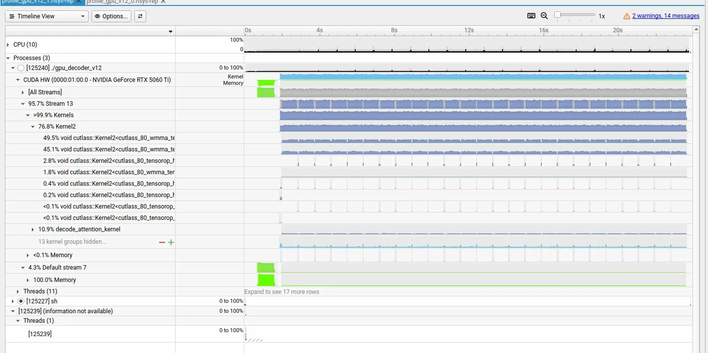

---

### inference_server（OpenAI 兼容推理服务）

基于 Drogon 实现 HTTP 推理服务，支持 continuous batching，兼容 OpenAI `/v1/chat/completions` 接口：

- 流式响应（SSE）：逐 token 蹦出，`stream=true`
- 非流式响应：等全部生成完再返回，`stream=false`
- 单机模式：prefill + decode 在同一进程
- P/D 分离模式：`--prefill-node <ip>` 指定 P节点地址，自动初始化 gRPC + NCCL

## Attention shared memory 限制

标准 attention kernel 用 shared memory 存 attention scores，大小为 `seq_len * sizeof(float)`：

```
3B: seq_len=32768 → shared_mem=128KB  ← 超出 GPU per-block 限制（通常 48-96KB）
```

通过 `CHECK_KERNEL()` 宏定位 kernel 启动失败，改为用全局内存存 attention scores。

## tests/

`tests/` 目录包含算法验证代码：

```
tests/softmax/    softmax → online softmax，numpy/torch/C++/CUDA 四种实现对比
tests/attention/  standard attention → flash attention，numpy/C++/CUDA 三种实现对比
```
